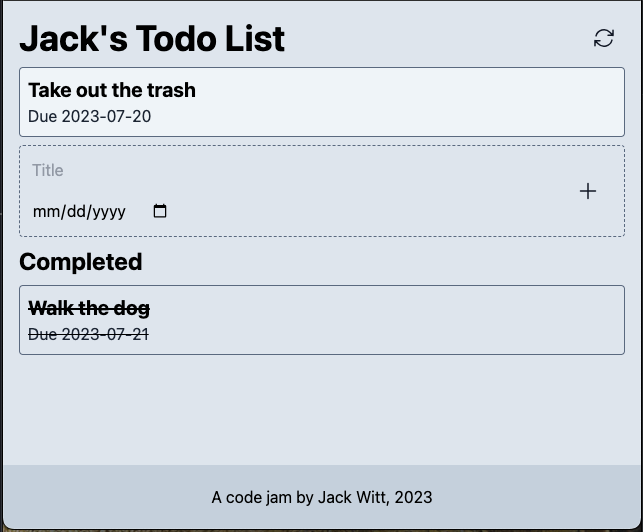
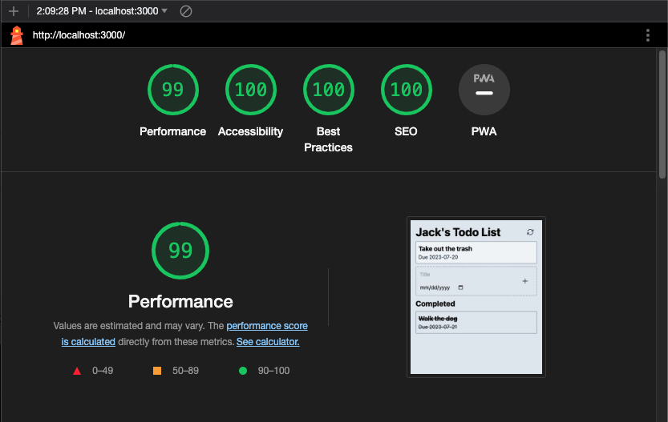

# htmx-todo



Simple TODO web app using typescript, express, prisma, pug, htmx and tailwind.

### Run the App locally

Developed using pnpm and nvm, so ensure these are installed locally. Development logging can be toggled in the `.env` file.

```bash
nvm use && pnpm i

# recommend running in a separate terminal
pnpm tw:watch

pnpm dev
```

### Run Prod Build

Compiles the project and runs the output from `/dist`.

```bash
pnpm build && pnpm start
```

### Lighthouse and Performance

This is cheating since the app is so small but even for side projects the goal is to meet all WCAG and performance standards.



### Resources

[HeroIcons](https://heroicons.com/)
